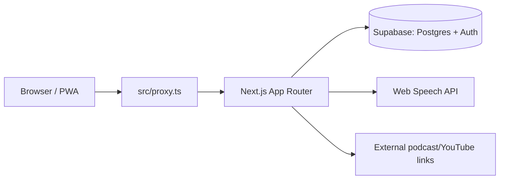

# Project map

Codebase map for `english_learning`. Full plan, decisions, roadmap and content
sourcing live in the dev plan doc — this file only tracks what actually exists
in the repo and how it fits together: https://claude.ai/artifact/2giVckYHw8DefDkW7KQTsE

## Architecture

- **`src/proxy.ts`** runs before every request (Next.js 16's replacement for
  `middleware.ts`): refreshes the Supabase session and redirects signed-out
  users to `/login`. Route matching is in `PUBLIC_PATHS` inside
  `src/lib/supabase/middleware.ts`.
- **Auth**: magic-link only (`supabase.auth.signInWithOtp`), no passwords.
  `src/app/auth/callback/route.ts` exchanges the emailed code for a session.
- **Data**: all reads/writes go through the Supabase clients in
  `src/lib/supabase/` — `client.ts` (browser), `server.ts` (Server Components /
  Route Handlers). Never call Postgres directly from a component.

## Directory map

| Path | Purpose |
| --- | --- |
| `src/app/layout.tsx` | Root HTML shell: fonts (Inter, Geist Mono), dark theme background |
| `src/app/globals.css` | Design tokens from `docs/DESIGN.md`, wired into Tailwind v4 `@theme` |
| `src/app/(auth)/login/` | Sign-in screen, no nav (route group has its own layout) |
| `src/app/(app)/` | Everything behind auth, wrapped by `NavBar` in `(app)/layout.tsx` |
| `src/app/(app)/page.tsx` | "Сегодня" — the daily 4-step session screen (route `/`) |
| `src/app/(app)/dashboard/page.tsx` | Progress dashboard (route `/dashboard`) |
| `src/app/auth/callback/route.ts` | Magic-link callback, not behind the `(app)`/`(auth)` groups |
| `src/app/(app)/session/vocab/` | Step 1: SM-2 card review (`VocabSession`) |
| `src/app/(app)/session/grammar/` | Step 1 add-on: grammar lesson — rule summary + exercises for the current unit (`GrammarSession`) |
| `src/app/(app)/session/reading/` | Step 2: today's text with studied words highlighted + true/false check (`ReadingSession`) |
| `src/components/` | Shared UI (`NavBar`, `StepCard`) and the per-step session components |
| `src/lib/supabase/` | Supabase client factories + session-refresh logic used by `proxy.ts` |
| `src/lib/supabase/types.ts` | DB types generated from the live project + convenience aliases at the bottom (regenerate after schema changes) |
| `src/lib/srs.ts` | Pure SM-2 spaced-repetition function (`reviewCard`) — no I/O, unit-testable |
| `src/lib/vocab.ts`, `grammar.ts`, `reading.ts` | Server actions per step: pick today's material, record results. Grammar answers are checked server-side |
| `src/lib/highlight.ts` | Pure splitter that finds studied headwords (+ simple inflections) in a text |
| `src/docs/` | The two textbook PDFs (grammar: Murphy, *Essential Grammar in Use*; words: Nation, *4000 Essential English Words 1*) — personal copies, git-ignored (copyrighted, never commit them) |
| `supabase/content/` | Hand-written content as JS modules (`grammar-topics.mjs`, `grammar-exercises.mjs`, `texts.mjs`, `words.mjs`) + `build-seed.mjs` / `build-words.mjs`, which validate them and generate `supabase/seed_phase2.sql` / `seed_words.sql` |
| `supabase/migrations/0001_init.sql` | Full schema: `words`, `texts`, `grammar_exercises`, `listening_items`, `cards`, `sessions`, `progress` + RLS policies |
| `supabase/migrations/0006_…`–`0007_…` | `words.sort_order` (learning order of new words) + `words.source` |
| `supabase/migrations/0003_…`–`0005_…` | Фаза 2: `grammar_topics` (one row per textbook unit), exercises linked to topics, `grammar_attempts`, `text_reads`, text questions |
| `docs/DESIGN.md` | Visual style reference (Raycast-style dark theme) |

## Routes

| Route | Auth | Screen |
| --- | --- | --- |
| `/login` | public | Magic-link sign-in |
| `/auth/callback` | public | Exchanges the email code for a session, redirects to `/` |
| `/` | required | "Сегодня" — 4 daily steps; steps 1-2 link to their sessions |
| `/session/vocab` | required | SRS card review |
| `/session/grammar` | required | Current grammar unit: first unit with exercises not yet mastered (latest attempt at every exercise correct); a retry serves only the mistakes |
| `/session/reading` | required | First unread text in catalog order (then the least recently read one) |
| `/dashboard` | required | Progress stats (static placeholders) |

## Status vs. the plan's phases

- ✅ **Фаза 0** — project skeleton, Supabase schema + auth, base layout/nav, empty dashboard.
- ✅ **Фаза 1** — vocabulary (825 words: starter set + all 600 words of the vocabulary textbook interleaved with 150 IT terms), SM-2 review screen, Web Speech TTS.
- ✅ **Фаза 2** — reading screen (12 texts A1-A2) and grammar lessons: all 115 textbook units in `grammar_topics`, summaries + 98 exercises for units 1-12. More units = more entries in `supabase/content/grammar-exercises.mjs`.
- ⬜ **Фаза 3-4** — listening/shadowing, fluency step, PWA/offline, streaks — not started.

Update this file when the directory structure or route map changes; it's meant
to stay a fast orientation point, not a duplicate of the full plan doc.
