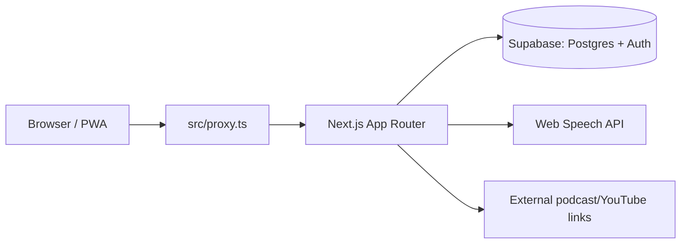

# Project map

Codebase map for `english_learning`. Full plan, decisions, roadmap and content
sourcing live in the dev plan doc — this file only tracks what actually exists
in the repo and how it fits together: https://claude.ai/artifact/2giVckYHw8DefDkW7KQTsE

## Architecture

- **`src/proxy.ts`** runs before every request (Next.js 16's replacement for
  `middleware.ts`): refreshes the Supabase session and redirects signed-out
  users to `/login`. Route matching is in `PUBLIC_PATHS` inside
  `src/lib/supabase/middleware.ts`.
- **Auth**: magic-link only (`supabase.auth.signInWithOtp`), no passwords.
  `src/app/auth/callback/route.ts` exchanges the emailed code for a session.
- **Data**: all reads/writes go through the Supabase clients in
  `src/lib/supabase/` — `client.ts` (browser), `server.ts` (Server Components /
  Route Handlers). Never call Postgres directly from a component.

## Directory map

| Path | Purpose |
| --- | --- |
| `src/app/layout.tsx` | Root HTML shell: fonts (Inter, Geist Mono), dark theme background |
| `src/app/globals.css` | Design tokens from `docs/DESIGN.md`, wired into Tailwind v4 `@theme` |
| `src/app/(auth)/login/` | Sign-in screen, no nav (route group has its own layout) |
| `src/app/(app)/` | Everything behind auth, wrapped by `NavBar` in `(app)/layout.tsx` |
| `src/app/(app)/page.tsx` | "Сегодня" — the daily 4-step session screen (route `/`) |
| `src/app/(app)/dashboard/page.tsx` | Progress dashboard (route `/dashboard`) |
| `src/app/auth/callback/route.ts` | Magic-link callback, not behind the `(app)`/`(auth)` groups |
| `src/components/` | Shared UI (`NavBar`, `StepCard`) |
| `src/lib/supabase/` | Supabase client factories + session-refresh logic used by `proxy.ts` |
| `src/lib/supabase/types.ts` | Hand-written DB types — **regenerate from the real project** once linked (see README) |
| `src/lib/srs.ts` | Pure SM-2 spaced-repetition function (`reviewCard`) — no I/O, unit-testable |
| `supabase/migrations/0001_init.sql` | Full schema: `words`, `texts`, `grammar_exercises`, `listening_items`, `cards`, `sessions`, `progress` + RLS policies |
| `docs/DESIGN.md` | Visual style reference (Raycast-style dark theme) |

## Routes

| Route | Auth | Screen |
| --- | --- | --- |
| `/login` | public | Magic-link sign-in |
| `/auth/callback` | public | Exchanges the email code for a session, redirects to `/` |
| `/` | required | "Сегодня" — 4 daily steps (static placeholders, not yet wired to data) |
| `/dashboard` | required | Progress stats (static placeholders) |

## Status vs. the plan's phases

- ✅ **Фаза 0** — project skeleton, Supabase schema + auth, base layout/nav, empty dashboard.
- ⬜ **Фаза 1** — vocabulary import + SM-2 review screen wired to `cards`/`words` (the `reviewCard` function in `src/lib/srs.ts` is ready to be called from it).
- ⬜ **Фаза 2-4** — reading, listening/shadowing, PWA/offline, streaks — not started.

Update this file when the directory structure or route map changes; it's meant
to stay a fast orientation point, not a duplicate of the full plan doc.
